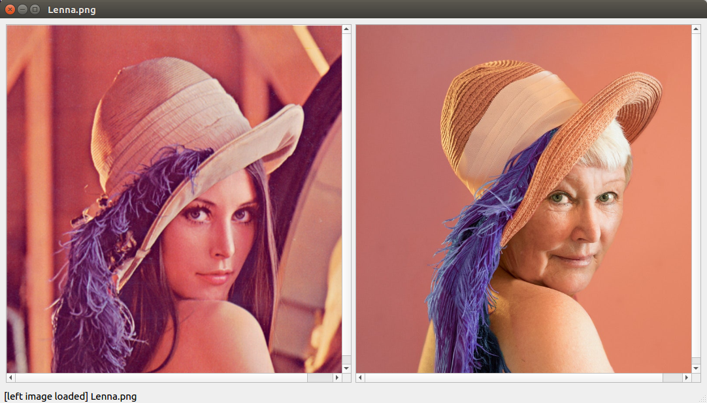
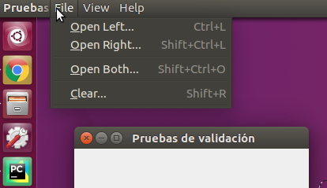
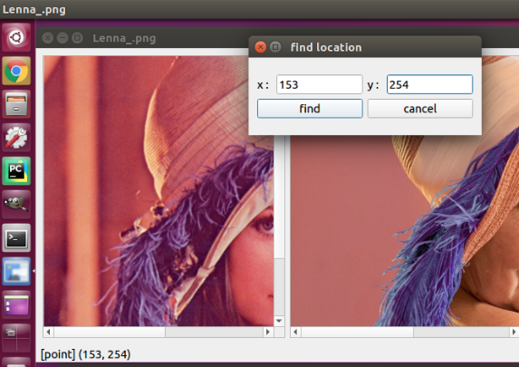

<h1 align="center">pruebas-de-validacion</h1>
<p>
  <a href="https://github.com/Odin-son/pruebas-de-validacion/blob/main/LICENSE" target="_blank">
    
  </a>
</p>

> 'pruebas-de-validacion' means acceptance testing,<br>
>  <br>
> image viewer for parallel comparison
>  <br>

## Author

👤 **Changwoo Song**

> Github: [@Odin-son](https://github.com/Odin-son) <br>
> LinkedIn: [@mdsd12](https://linkedin.com/in/mdsd12) <br>
> 
> This project was inspired from [acbetter](https://gist.github.com/acbetter/e7d0c600fdc0865f4b0ee05a17b858f2)
## Requirements
* library
    * PyQt5

## Getting Started
> in case of using virtualenv,
```bash
$ virtualenv [env_name] --python=python3.7
$ source [en_name]/bin/activate
```
> in case of using anaconda,
```bash
$ conda create -n [env_name] python=3.7
$ conda activate [env_name]
```
> install required library(CLI)
```
$ pip install PyQt5 pyperclip 
```

## How to use
> From now on, execute program by using command `python viewer.py`
```
$ cd path/to/project
$ cd src/``
$ python viewer.py
```
> Choose the menu items when the program runs
>

>
> Before using `Open Both...`, there is required structure below:
```
# use the same filename for each sub-directory
ROOT
├── original
│   ├── image.png
│   └── ...
└── mask
    ├── image.png
    └── ...
```
> In case of using `Find...`, the viewer is located in the center based entered position
>

> In case of using `Find Direct...`, the viewer is located in the center based on content of clipboard  
> There is a function which is able to extract only number from content of clipboard
## Troubleshooting
```
$ cd path/to/project
$ cd src/
$ python viewer.py 
qt.qpa.plugin: Could not load the Qt platform plugin "xcb" in "" even though it was found.
This application failed to start because no Qt platform plugin could be initialized. Reinstalling the application may fix this problem.

Available platform plugins are: eglfs, linuxfb, minimal, minimalegl, offscreen, vnc, wayland-egl, wayland, wayland-xcomposite-egl, wayland-xcomposite-glx, webgl, xcb.

Aborted (core dumped)
```
> sudo apt-get install "^libxcb.*" libx11-xcb-dev libglu1-mesa-dev libxrender-dev

## 📝 License
Copyright © 2020 [Changwoo Song](https://github.com/Odin-son).
This project is [MIT](https://github.com/Odin-son/pruebas-de-validacion/blob/main/LICENSE) licensed.
